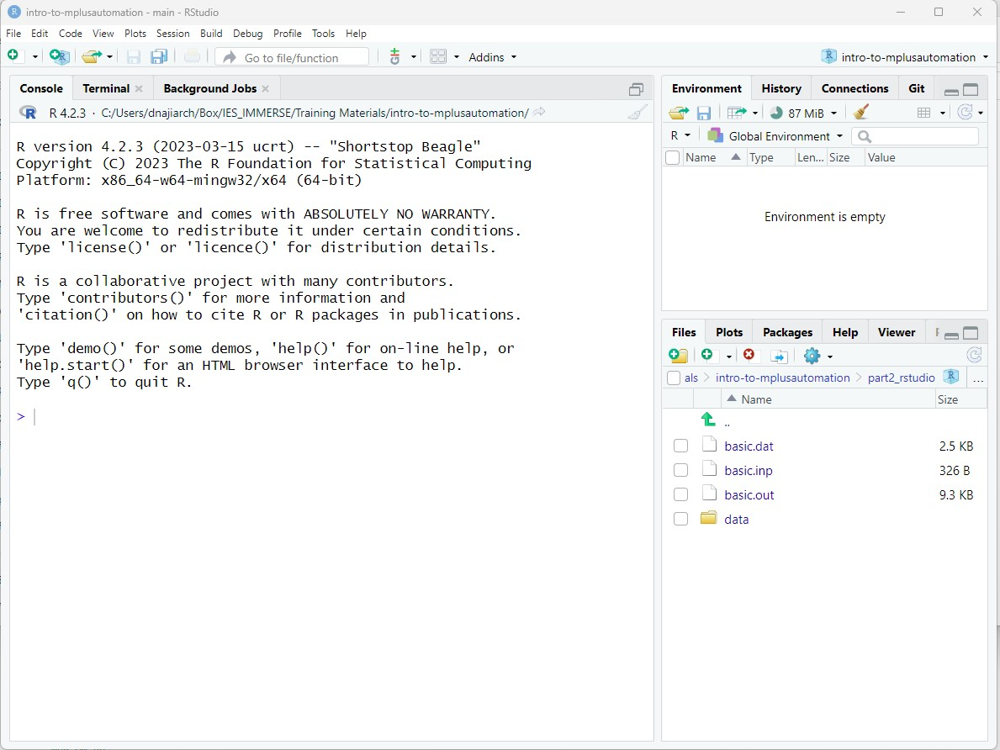
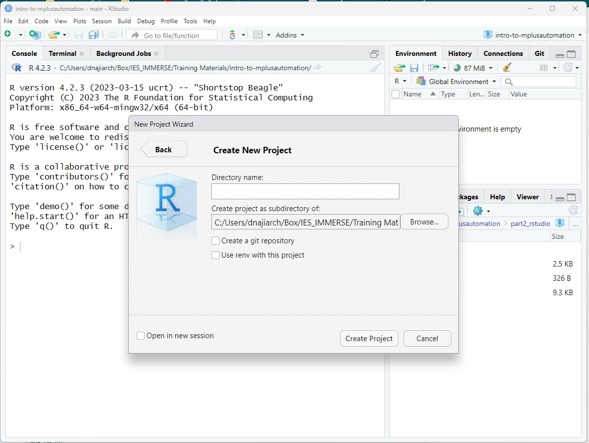
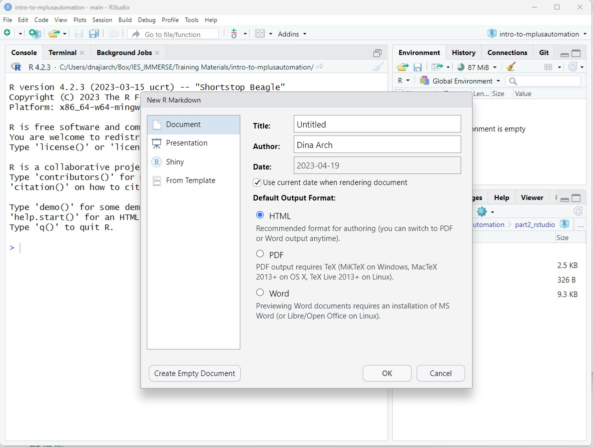

```{r, echo=FALSE}
htmltools::img(src = knitr::image_uri(file.path("figures/mm4dber_white.jpg")), 
               alt = 'logo', 
               style = 'position:absolute; top:0; right:0; padding:10px;',
               width ="250",
               height ="193")
```

```{r setup, include=FALSE}
knitr::opts_chunk$set(echo = TRUE, warning = FALSE, message = FALSE,
                      tidy.opts=list(width.cutoff=60))
```

# --------------------------------------------------------------------------------------


```{r, echo=FALSE, out.width='35%', fig.align='center'}
knitr::include_graphics("figures/NSF-Logo.png")
```

# --------------------------------------------------------------------------------------

Mixture Modeling for Discipline Based Education Researchers (MM4DBER) is an NSF funded training grant to support STEM Education scholars in integrating mixture modeling into their research.

-   Please [visit our website](https://mm4dbers.education.ucsb.edu/) to learn more and apply for the year-long fellowship.

-   Follow us on [Twitter](https://twitter.com/mm4dbers)!

Visit our [GitHub](https://github.com/MM4DBER/intro-to-rstudio) account to download the materials needed for this walkthrough.

# --------------------------------------------------------------------------------------

## Introduction to RStudio

In this exercise we will obtain the same Mplus *.out* file that we produced using the `Mplus` program using `RStudio`.

Here we will use the [`MplusAutomation`](https://michaelhallquist.github.io/MplusAutomation/) package (Hallquist & Wiley, 2018).

### WHAT is `MplusAutomation` & WHY should we use it?

**WHAT?**

-   `MplusAutomation` is an `R` package
-   It "wraps around" the `Mplus` program
-   Requires both `R` & `Mplus` software
-   Requires learning some basics of 2 syntax languages
-   Car metaphor: R/Rstudio is the *steering wheel or dashboard* & Mplus is the *engine*

**WHY?**

-   `MplusAutomation` can provide clearly organized work procedures in which every research decision can be documented in a single place
-   Increase reproducibility, organization, efficiency, and transparency

**HOW?**

-   The interface for MplusAutomation is entirely within R-Studio. You do not need to open Mplus
-   The code presented will be very repetitive by design

# --------------------------------------------------------------------------------------

### Step 1: Open RStudio



Open R studio on your desktop.

**IMPORTANT**: Because we are using a package that communicates with Mplus, we *must* use have Mplus installed to run Rstudio.

# --------------------------------------------------------------------------------------

### Step 2: Create a new R-project



R-projects help us organize our folders , filepaths, and scripts.
To create a new R project:

    0. File --\> New Project...

    1. Click "New Directory" --\> New Project --\> Name your project (e.g., "mauto-day5")

**NOTE ABOUT PROJECT LOCATION (IMPORTANT)**: Choose a location on your computer that is not in too many enclosing folders. If your file path is too long (longer than 90 characters), Mplus cuts off the file.path and you will receive an **error message**. 

    2. Click "Create Project" to save your project (It will save as a folder on your computer).

    3. Copy all the materials found on Github into this new project folder you created.
    
# --------------------------------------------------------------------------------------

### Step 3: Create an R-markdown document



- [`R-markdown`](https://rmarkdown.rstudio.com/): The `R-markdown` format provides a platform for us to neatly share our data science results. It allows us to organize our reports using texts, figures, and R code.

- This document you are reading was made using R-markdown!

- Next we will create an R-markdown file and write script to run a `type=basic` analysis using the R package, `MplusAutomation`.

To create an R-markdown:

0.   File --\> New File --\> R Markdown...

1. Give the R-markdown a title such as "**Introduction to MplusAutomation**" Click "OK." You should see a new markdown with some example text and code chunks.

2. We want a clean document to start off with so delete everything from line 10 down.

3. Go ahead and save this document.

# --------------------------------------------------------------------------------------

### Step 4: Load packages

- The first code chunk (lines 8-10) is call the `r setup` code chunk. This will set the defaults for your document. For now we will leave this as is. 
- The next code chunk in any given markdown should be the packages you will be using.
- To insert a code chunk, either use the keyboard shortcut `ctrl + alt + i` OR click the green button with the letter `C` on it (top panel).
- There are a few packages we want to read in:

```{r}
library(MplusAutomation)
library(tidyverse) # Collection of R packages designed for data science
library(here) # To set our file.paths 
library(haven) # read_sav()
library(psych) # describe()
library(ggpubr) # ggdensity() and ggqqplot()
library(corrplot) # corrplot()
here::i_am("Intro-to-Mplusautomation.Rmd")
```

**Common error message types:** [E.g.,...] 

- If a function does not work and you receive an error message: `could not find function "xxx_function"` 
- [OR] If you try to load a package and you receive an error like this: `` there is no package called `xxx_package` `` 
- then you will need to install the package using: `install.packages("xxx_package")` 

### Step 5: Read in data set

Recall that our data set that we used earlier is a *.dat* file with no variable names.
Remember that this is a data set specifically designed for Mplus.
Let grab the original one (an SPSS file) in the `data` folder within the `part2_rstudio` folder.

```{r}
data_lsay <- read_csv(here("data", "lsay_sci_data.csv"))

# Ways to view data in R:
# 1. click on the data in your Global Environment (upper right pane) or use...
View(data)

# 2. summary() gives basic summary statistics & shows number of NA values
summary(data)

# 3. names() provides a list of column names. Very useful if you don't have them memorized!
names(data)

# 4. head() prints the top x rows of the dataframe
head(data)
```

### Step 6: Using `MplusAutomation`

To run a basic model using `MplusAutomation` we used the `mplusObject()` function and the `mplusModeler()` function.

**What does the** `mplusObject()` **function do?**

1. It generates an Mplus input file (does not need full variable name list, its automated for you!) 
2. It generates a datafile specific to each model 
3. It runs or estimates the model (hopefully) producing the correct output. Always check!

**What does the** `mplusModeler()` **function do?**

1.  Creates, runs, and reads Mplus models created using `mplusObject()`
2.  You can specify where you want the *.out* file saved
3.  `check=TRUE` checks for missing semicolons, `run=TRUE` runs the model, `hashfilename=FALSE` does not add a hash of the raw data to the datafile name.

```{r, echo=TRUE, eval=FALSE}
m_basic  <- mplusObject(
  
  TITLE = "PRACTICE 01 - Explore descriptives (TYPE = BASIC;)",
  
  VARIABLE = 
 "usevar= Enjoy Useful Logical Job Adult Female;",
  
  ANALYSIS = 
 "type = basic; ",
 
  usevariables = colnames(data_lsay), 
  rdata = data_lsay)

m_basic_fit <- mplusModeler(m_basic, 
               dataout=here("mplus_files", "basic_example.dat"),
               modelout=here("mplus_files", "basic_example.inp"),
               check=TRUE, run = TRUE, hashfilename = FALSE)
```

**NOTE**: You don't need to specify `MISSING` here since it automatically detects the missing value from the data set.
You also don't need `NAMES` as it detects the names from the data set.

**Optional: Subsetting observations**

You can use Mplus syntax to explore descriptives for observations reported as "female."

Add line of syntax: `useobs = female == 1;`

```{r,echo=TRUE, eval=FALSE}
fem_basic  <- mplusObject(
  
  TITLE = "PRACTICE 02 - Explore descriptives for female observation subset", 
  
  VARIABLE = 
  "usevar = Enjoy Useful Logical Job Adult Female;
   
   useobs = Female == 1; !!! subset observations that report female in analysis !!!",
  
  ANALYSIS = 
    "type = basic;",
 
  usevariables = colnames(data_lsay), 
  rdata = data_lsay)

fem_basic_fit <- mplusModeler(fem_basic, 
               dataout=here("mplus_files", "fem_basic.dat"),
               modelout=here("mplus_files", "fem_basic.inp"),
               check=TRUE, run = TRUE, hashfilename = FALSE)

```

- After running an `MplusObject` function, MplusAutomation will generate an output file.
- ALWAYS check your output before moving forward with your analyses.
- It's easy to skip past checking our output since MplusAutomation doesn't automatically present it to us after running the code.
- It's good practice to make it a habit to check your output file after every run.

------------------------------------------------------------------------

## PART 3: Data Cleaning & Screening

It's important to explore your data before running your analyses. First, lets rename our variables to something more meaningful using `rename()`.
As a reminder, use the pipe operator `%>%` to create a sequence of functions, you can use the shortcut crt + shift + m:

```{r}
# read the new data file  into R
exp_data <- read_csv(here("data", "exp_data.csv"))
```


```{r}
clean_data <- exp_data %>%
  rename(school_motiv1 = item1,
         school_motiv2 = item2,
         school_motiv3 = item3,
         school_comp1 = item4,
         school_comp2 = item5,
         school_comp3 = item6,
         school_belif1 = item7,
         school_belif2 = item8,
         school_belif3 = item9)
```

### Descriptive Statistics

Let's look at descriptive statistics for each variable using `psych::describe()` function :

```{r}
clean_data %>% 
  describe()
```

What if we want to look at a subset of the data?
For example, what if we want to see those who identify as female?
We can use `tidyverse::filter()` to subset the data using certain criteria.

```{r}
clean_data %>% 
  filter(female == 1) %>% 
  describe()

#You can use any operator to filter: >, <, ==, >=, etc.
```

### Missing Values

Let's check for missing values.
First, how are missing values identified?
They could be `-999`, `NA`, or literally anything else.
The simplest way to do this is to look back at the `summary()` function.
There are four variables with one missing value.

```{r}
clean_data %>% 
  summary() 

# summary(new_names)
```

### Recode Continuous Variable into Factor

What if you want to recode a continuous variable into different levels (e.g., high, medium, and low)?
Let's use the variable `school_belief1` as an example.
First, let's recall the descriptives:

```{r}
new_names %>% 
  select(school_belif1) %>% 
  summary() 
```

Here, we can see that the values range from 1 - 10.
Lets recode the variable to look like this:

|        |        |
|--------|--------|
| Low    | 1 - 3  |
| Medium | 4 - 6  |
| High   | 7 - 10 |

We use `cut()` to divide continuous variables into intervals:

```{r}

school_factor <- new_names %>% 
  mutate(school_factor = cut(school_belif1,
                      breaks = c(0, 3, 6, 10), #Use 0 at the beginning to ensure that 1 is included in the first break, then break by last number in each section (3, 6, 10) 
                      labels = c("low", "medium", "high")))
# View summary
school_factor %>% 
  select(school_belif1, school_factor) %>% 
  summary() 
```

### Normality and Distributions

It's important to inspect the distribution of the data.
Many analyses are sensitive to violations of normality so in order to make sure you are confident that our data are normal, there are several things we can look at: density plots, histograms, QQ plots, box plots, scatterplots, and the descriptives such as skewness and kurtosis.
Normally, we would want to inspect every variable, but for demonstration purposes, lets focus on the `school_belif1` variable.

#### Density Plots

A density plot is a visualization of the data over a continuous interval.
As we can see by this density plot, the variable `school_belif1` is positively skewed.

```{r}
ggdensity(new_names$school_belif1, fill = "lightblue")
```

#### Histogram

A histogram provides the same information as the density plot but provides a count instead of density on the x-axis.

```{r}
hist(new_names$school_belif1, col = 'lightyellow')
```

#### QQ Plots

QQ plot, or quantile-quantile plot, is a plot of the correlation between a sample and the normal distribution.
In a QQ plot, each observation is plotted as a single dot.
If the data are normal, the dots should form a straight line.
If the data are skewed, you will see either a downward curve (negatively skewed) or upward curve (positively skewed).

```{r}
ggqqplot(new_names$school_belif1)
```

As you can see in this QQ plot, there is an upward curve, which further tells us that we have a positively skewed variable.

#### Box Plots

Box plot can show us distributions, specifically the minimum, first quartile, median, third quartile, and maximum.

```{r}
new_names %>% # 
  ggplot(aes(y = school_belif1)) +
  geom_boxplot() 
```

#### Bivariate Scatterplots

We can use `pairs()` to look at bivariate scatterplots.
Do the relationships look linear?:

```{r}
pairs(new_names)

# Or we can look at individual scatterplots:
new_names %>% 
  ggplot(aes(school_belif1, school_belif2)) +
  geom_point() +
  geom_smooth(method = "lm", se =F) +
  theme_minimal()
```

We can also use `cor()` to look at bivariate correlations for the entire data set (Note: Missing values are not allowed in correlation analyses, use `drop_na()` to do listwise deletion):

```{r}
new_names %>% 
  drop_na() %>% #remove missing data
  cor(method = "pearson") %>% 
  round(2) # round to 2 decimal places 

# A colorful plot:
f_cor <- cor(new_names, use = "pairwise.complete.obs")
corrplot(f_cor,
         method="number",
         type = "upper")

#Fun tip: `apa.cor.table()` creates an APA formated correlation matrix and saves it to your computer
#apa.cor.table(physics, filename = "cor_table.doc")
```

#### Skewness and Kurtosis

One final thing to look are the skewness and kurtosis values in the descriptive statistics provided earlier.
There are many different sources that provide different cut-off values, but as a general rule of thumb, skewness and kurtosis values greater than +3/-3 indicate a non-normal distribution.
Positive skew values indicate positively skewed variables and negative skew values indicate negatively skewed variables.
Positive values of kurtosis indicate leptokurtic distributions, or higher peaks with taller tails than a normal distribution.
Negative values of kurtosis indicate platykurtic distributions, or flat peaks with thin tails.

```{r}
describe(new_names$school_belif1)
```

Here we can see that the *skew* value is less than 3 and the *kurtosis* value is less than 3, indicating a normal distribution.


# --------------------------------------------------------------------------------------


